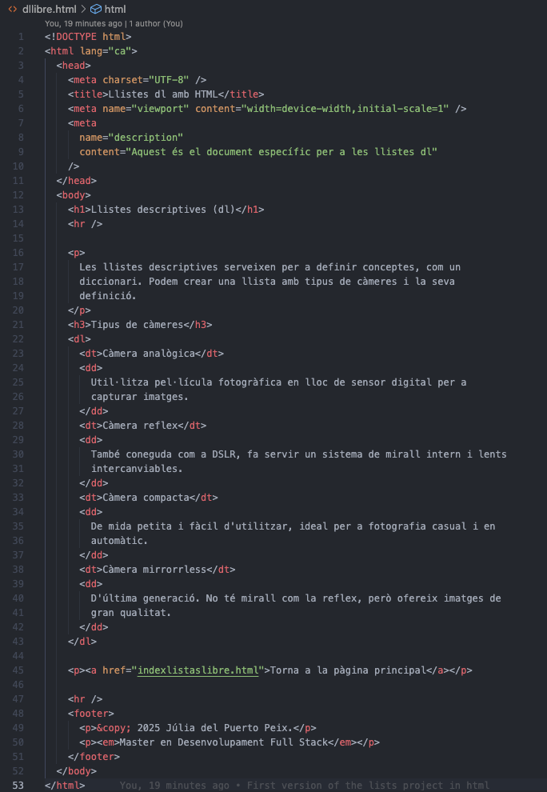
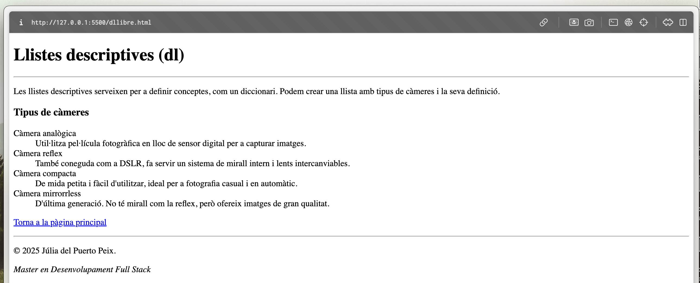

# Second HTML Project - Lists Examples

This repository contains my second HTML project created from scratch as part of my full-stack web development master's program.

In this project, I explore different types of HTML lists: unordered lists (`<ul>`), ordered lists (`<ol>`), and definition lists (`<dl>`). Each type has its own separate example page, linked from the main `index.html`.

---

## Project Structure

- `index.html`: Main page with links to the different list examples.
- `ul.html`: Example of unordered lists.
- `ol.html`: Example of ordered lists.
- `dl.html`: Example of definition lists with camera types.

---

## Best Practices Followed

- Clean and semantic HTML structure.
- Proper use of list tags (`<ul>`, `<ol>`, `<dl>`) according to their meaning.
- Meaningful link text for accessibility.
- Consistent indentation and formatting.

---

## Definition List (dl) Example

Here are two screenshots showing the code and the rendered result using Live Server:

### Code

### Result

---

I will keep sharing more practical exercises as I progress through the master’s program.

If you’re learning web development or programming too, feel free to connect and share knowledge! 🙌

---

#HTML #frontend #webdevelopment #fullstack #codingjourney #lists
